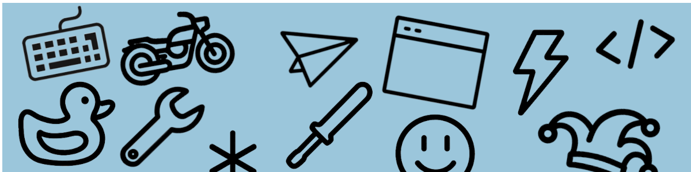

    

<h1>Hi, I'm Bryan!</h1>

USAF Veteran // Front-end Developer // Dad // Biker // Intergalactic Bounty Hunter // Comedian

 

#### :: a little bit about me ::

- I am... currently seeking new opportunites to continue my 15+ year career as a front-end engineer.
- I have an eclectic background in construction, user experience, front end development, and consulting.
- I have a deep rooted love for beautiful web design, user experience, clean code, accessibility, and so much more.
- Currently learning: Storyblok.
- Currently loving: React, TypeScript, Next.js and TailwindCSS.
- If I'm not writing code I'm probably out on my motorcycle.

#### :: my toolbelt ::

##### languages, libraries, & frameworks

  
  
  
  
  
  
  
  
  
  
  
  
  
  
  
  
  
  
  
  

##### tools & practices

  
  
  
  
  
  
  
  
  
  
  
  
  
  
  

##### other

  
  
  
  
  
  

#### :: my github stats ::

   
  

