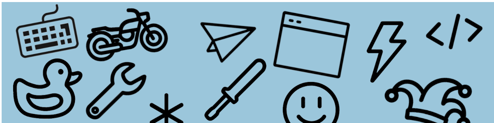

    

<h1>Hi, I'm Bryan!</h1>

Engineering Leader // USAF Veteran // Dad // Biker // Intergalactic Bounty Hunter // Comedian

 

#### :: a little bit about me ::

- I'm Director of Software Development at [Upstream Impact](https://www.linkedin.com/company/upstream-impact-software). My team builds software that helps food pantries and human-services nonprofits serve more people.
- 15+ years in frontend architecture, design systems, and developer experience. I've led a 26-engineer discipline and cofounded its design system. Now I grow small teams that punch above their weight.
- CSS was my first language. It started a career-long love affair with design, experience, and the systems beneath.
- One principle above the rest: **intuitive first, elegant always.**
- Service is my through-line: the Air Force, veteran advocacy, the products my team ships.
- If I'm not working, I'm out on my motorcycle.

#### :: my toolbelt ::

##### building with

  
  
  
  
  
  
  
  
  
  
  
  
  

##### leading with

  
  
  
  
  
  
  
  

#### :: my github stats ::

  

